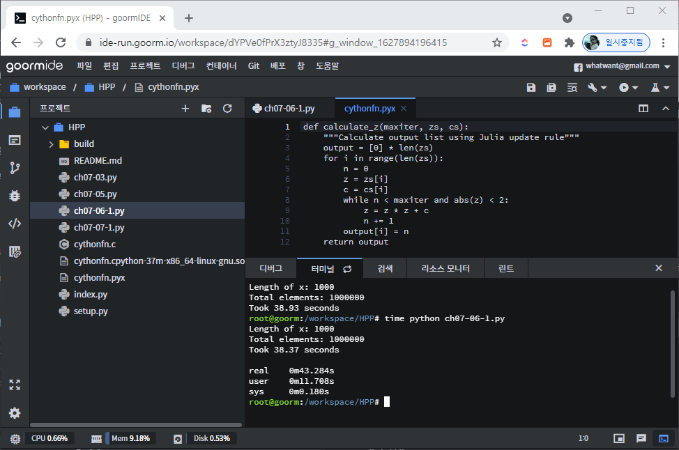

# Chapter 07 - C 언어로 컴파일하기


## kind of compiler

### Cython(사이썬)
- C-Extensions for Python
- C 언어로 컴파일하기 위해 사용하는 가장 일반적인 도구
- Numpy와 일반 파이썬 코드를 모두 커버(단, C 언어를 어느 정도 이해해야 함)
- 2007년 발표
- Pyrex(2002년 발표) 파생 프로젝트
- Cython 기반 라이브러리
  - SciPy(사이파이): 과학기술계산
  - Scikit-Learn(사이킷런): 머신러닝
  - lxml: Processing XML and HTML
  - ZeroMQ: 분산/동시성 애플리케이션에 사용하도록 개발된 고성능 비동기 메시징 라이브러리
- https://cython.org/

### Numba
- Numba translates Python functions to optimized machine code at runtime using the industry-standard LLVM compiler library.
- numpy 코드에 특화된 새로운 컴파일러
- http://numba.pydata.org/

### PyPy
- replacement for CPython. It is built using the RPython language that was co-developed with it.
- 일반 파이썬 실행환경을 대체하는 非 numpy 코드를 위한 JIT 컴파일러
- https://www.pypy.org/


---
## compile을 통한 속도 개선

### calculate vs. others
- 같은 연산을 무수히 반복하는 코드가 많은 수학적인 연산에서 속도 개선 효과(임시 객체를 많이 사용하기 때문?)
- 입출력 관련 코드, 외부 라이브러리(정규 표현식, 문자열 연산, DB 라이브러리 호출) 등에서는 효과 없음

### numpy vs. others
- numpy 연산은 임시 객체를 많이 사용하지 않으므로 효과 없음
- Python 코드이고 대부분의 코드가 루프일 때 속도 개선 효과


---
## JIT vs. AOT

### AOT (Ahead Of Time)
- Cython
- 사용할 컴퓨터에 특화된 정적 라이브러리 생성
- 사용하기 전에 미리 컴파일하므로 코드에서 바로 해당 라이브러리 사용
- 직접적인 노력이 많이 들지만, 최선


### JIT (Just In Time)
- Numba, PyPy
- 어떤 작업도 미리하지 않고 컴파일러가 적절할 때에 컴파일 시작 → `콜드 스타트` 문제 존재
  - 아무것도 컴파일되지 않은 경우, 실행 후 컴파일하느라 초반에 느린 속도
  - 여러번 실행해야 하는 경우에는 적용하지 않는 것이 바람직
- 직접적인 노력이 거의 들지 않지만, `콜드 스타트` 문제


---
## Data Type
- Python is dynamically typed


### abs()
- 정수/실수 = 음수 → 양수
- 복소수 = 실수와 허수의 제곱의 합의 제곱근


### overhead
- abs()를 호출하기 전에 Python은 먼저 해당 변수의 타입 확인 → 어떤 버전의 함수를 호출할지 결정 = 이 호출 횟수가 많을 수록 성능 저하
- Python 기본 객체(like 정수)는 내부적으로 고수준의 Python 객체가 감싼다(정수는 int 타입)
  - 고수준의 객체는 저장에 필요한 `__hash__`, 출력에 필요한 `__str__` 등의 추가 함수 포함 → overhead
- 중간 계산 과정을 직접 수행 → 고수준의 함수 불필요 → 객체 참조 카운트 불필요
  - 기계어와 바이트로 계산
- 객체를 사용하기 전에 그 타입을 결정해두어야 올바른 C 코드 생성 가능


---
## C compiler

### gcc
- Cython 에서 사용


---
## Julia update rule


---
## cython
- python vs. cython

```python
def calculate_z_serial_purepython(maxiter, zs, cs):
    """Calculate output list using Julia update rule"""
    output = [0] * len(zs)
    for i in range(len(zs)):
        n = 0
        z = zs[i]
        c = cs[i]
        while abs(z) < 2 and n < maxiter:
            z = z * z + c
            n += 1
        output[i] = n
    return output
```

- `cythonfn.pyx` 파일 생성

```python
def calculate_z(int maxiter, zs, cs):
    """Calculate output list using Julia update rule"""
    cdef unsigned int i, n
    cdef double complex z, c
    output = [0] * len(zs)
    for i in range(len(zs)):
        n = 0
        z = zs[i]
        c = cs[i]
        while n < maxiter and (z.real * z.real + z.imag * z.imag) < 4:
            z = z * z + c
            n += 1
        output[i] = n
    return output
```

### `cythonfn.pyx` 파일에 있는 함수로 대체

```python
"""Julia set generator without optional PIL-based image drawing"""
import time
#from cythonfn import calculate_z
import cythonfn 

# area of complex space to investigate
x1, x2, y1, y2 = -1.8, 1.8, -1.8, 1.8
c_real, c_imag = -0.62772, -.42193

def calc_pure_python(desired_width, max_iterations):
    """Create a list of complex co-ordinates (zs) and complex parameters (cs), build Julia set and display"""
    x_step = (x2 - x1) / desired_width
    y_step = (y1 - y2) / desired_width
    x = []
    y = []
    ycoord = y2
    while ycoord > y1:
        y.append(ycoord)
        ycoord += y_step
    xcoord = x1
    while xcoord < x2:
        x.append(xcoord)
        xcoord += x_step
    # build a list of co-ordinates and the initial condition for each cell.
    # Note that our initial condition is a constant and could easily be removed,
    # we use it to simulate a real-world scenario with several inputs to our function
    zs = []
    cs = []
    for ycoord in y:
        for xcoord in x:
            zs.append(complex(xcoord, ycoord))
            cs.append(complex(c_real, c_imag))

    print("Length of x:", len(x))
    print("Total elements:", len(zs))
    start_time = time.time()
    output = cythonfn.calculate_z(max_iterations, zs, cs)
    end_time = time.time()
    secs = end_time - start_time
    print(f"Took {secs:0.2f} seconds")

    assert sum(output) == 33219980  # this sum is expected for 1000^2 grid with 300 iterations


# Calculate the Julia set using a pure Python solution with
# reasonable defaults for a laptop
calc_pure_python(desired_width=1000, max_iterations=300)
```

### `setup.py` 파일 생성

```python
from distutils.core import setup

from Cython.Build import cythonize
setup(ext_modules=cythonize("cythonfn.pyx", compiler_directives={"language_level": "3"}))
```

- `Python 3` 지원을 명시하기 위해 `"language_level": "3"`으로 지정한다.


### build

```bash
$ python setup.py build_ext --inplace
```


- `build_ext` 옵션으로 `setup.py` 실행하면 된다
- `--inplace`: 컴파일된 모듈을 현재 디렉토리에 생성
  - `cythonfn.c` 파일도 생성된다
  - `so` 파일도 생성되는데, `cythonfn.cpython-37m-x86_64-linux-gnu.so`와 같이 원하는 이름은 아니다 ^^


### execute
- 엄청난 속도 개선을 확인해볼 수 있다


